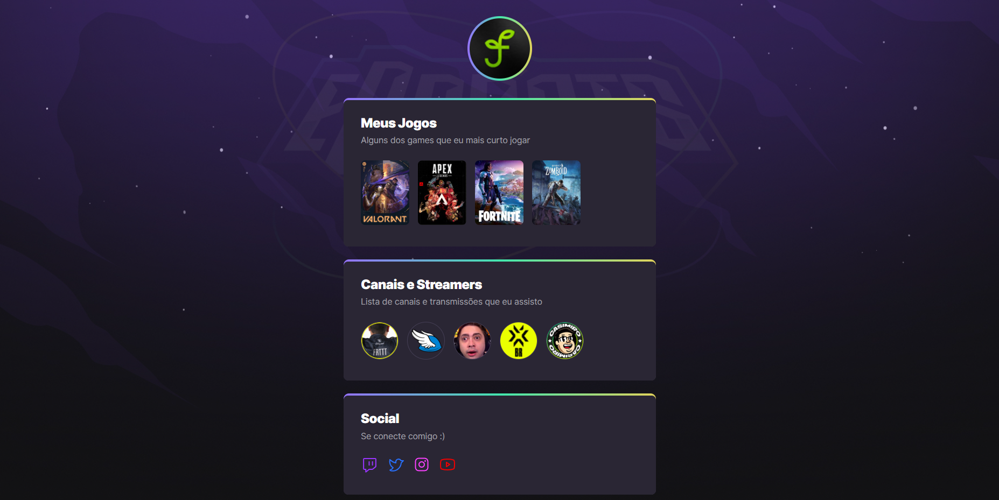

# 🚀 NLW eSports - Trilha Explorer

Projeto construído do evento Next Level Week da Rocketseat em Setembro de 2022. Consiste em uma plataforma para encontrar amigos para jogar, se conectar através das redes sociais e
mostrar seus games e streamers preferidos

[🔗 Clique aqui para acessar 🔗](https://duartefabricia.github.io/NLW-eSports/)

## 🛠️ Tecnologias Utilizadas

- HTML
- CSS
- Git e Github